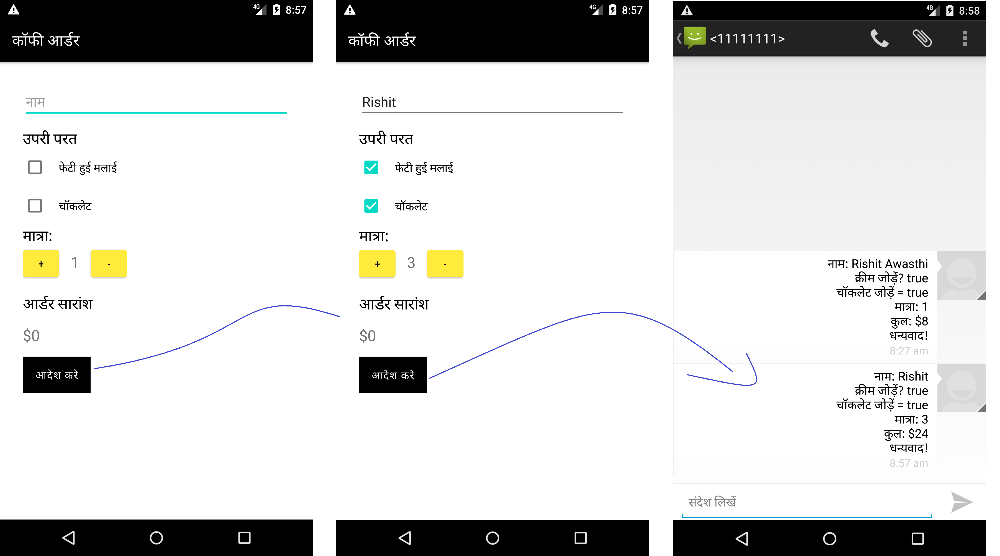
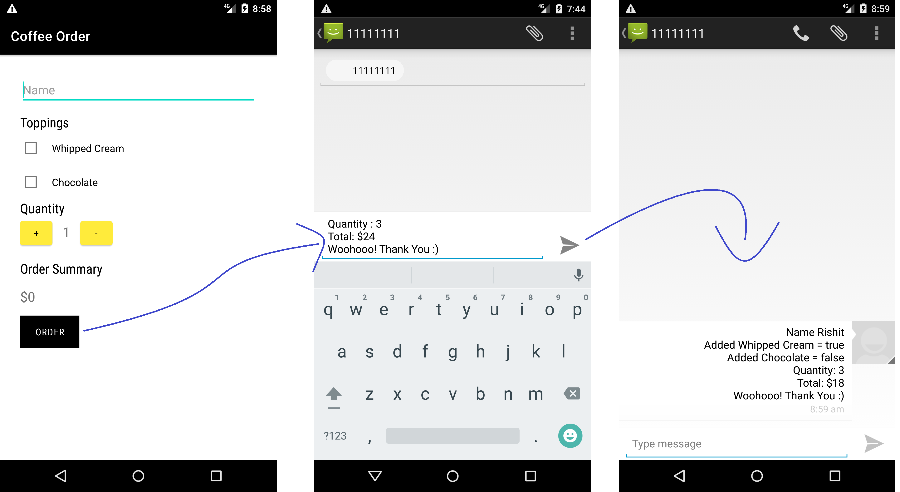

# Coffee Ordering App
 This is a sample Coffee Ordering App , built just to implement some of my learnings in Android Development.
# Learnings (How to?) 
- Use Intents
- Localize the App
- Add Different Languages Support
- Use Different View Elements
- Comfortable with Java OOPS :)

# Screenshots 
## Hindi Language Support

## English Language Support

